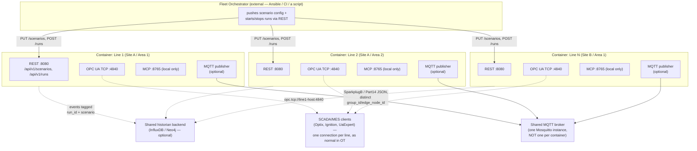
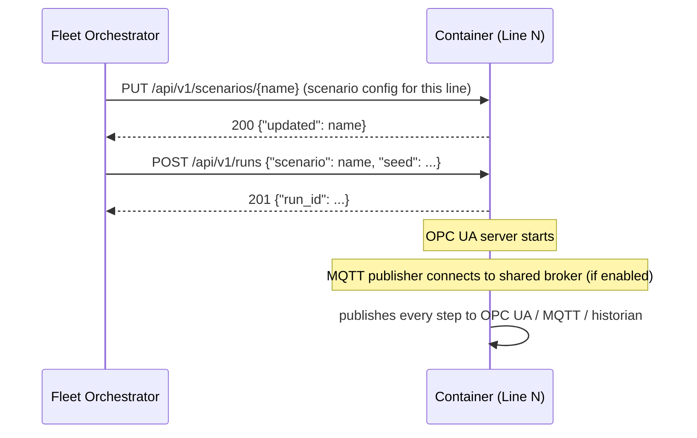
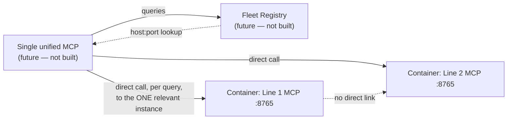

# Horizontal Fleet Deployment (Multiple Lines, One Container Each)

How to run simengine as a fleet — one container per production Line, each
belonging to some Site/Area under one Enterprise — using what exists today,
plus the one piece (a fleet registry) that doesn't exist yet.

**Scope note:** this assumes each container operates independently and
headless — no cross-line queries, no single UI spanning multiple lines, no
containers talking to each other. That's true today and, per the "not
required" scoping below, stays true even after the fleet registry exists.

## The core fit: one container already means one Line

`RunManager` allows exactly one active run per process — a second `start`
gets a 409 (`RunConflictError`). So "one container per Line" isn't a
workaround shape being forced onto the engine; it's the unit the engine
already assumes. `enterprise` / `site` / `area` / `line_name` are just
scenario config keys — they don't imply any deployment concern of their own.
A scenario file *is* "this container's Line within this Area/Site."

## Fleet topology — what runs where

No arrows between `L1`/`L2`/`L3` — that's deliberate, not an omission. Lines
don't know about each other and don't need to.

## What already works, with zero code changes

| Concern | How it's covered today |
|---|---|
| Per-line identity | `enterprise`/`site`/`area`/`line_name` in that container's scenario config — drives the OPC UA address space, the knowledge graph, and SparkplugB `group_id`/`edge_node_id`. |
| No Mosquitto per container | `comms.opcua_mqtt.enabled` / `comms.sparkplugb.enabled` are independent flags. Both `false` → zero MQTT connections, OPC UA TCP only. If some lines want MQTT/SparkplugB, point every container's `broker:` at **one shared broker**, not one each — SparkplugB's topic hierarchy (`spBv1.0/{group_id}/{msg_type}/{edge_node_id}/...`) exists precisely so many edge nodes share one broker without collision, provided each line gets distinct `group_id`/`edge_node_id`/`publisher_id`. |
| Scenario push | Either REST (`PUT`/`POST /api/v1/scenarios`, then `POST /api/v1/runs {"scenario": ...}` — no filesystem access to the container needed) or file-based provisioning (mount/bake a `scenarios.yaml`, tell it which named scenario to run). A file may hold many scenarios; only one runs at a time per container. |
| Shared historian | Point every container's `INFLUXDB_URL` / `NEO4J_URI` at one central instance. Confirmed in `simengine_historian_influx`: every point is tagged with `run_id` (and scenario), so multi-line writes to one bucket don't collide. |
| Headless, no client contention | `RunManager`'s lock only protects concurrent calls *within one process*. There is no shared state across containers — if the orchestrator is the only caller of any given container's REST API, there is nothing to contend over. This is a property of the process boundary, not something added for this use case. |
| Liveness | `GET /healthz` → `{"status": "ok", "run_state": ...}`, fine for container-orchestrator health checks as-is. |

## Provisioning flow (push model)

Same shape whether the orchestrator is a script, an Ansible playbook, or a
CI job — it only needs each container's REST endpoint reachable at deploy
time.

## What needs to be built: a fleet registry

Nothing today tracks **which container is running which scenario, at what
host:port, for which site/area/line**. That bookkeeping currently has to
live entirely in whatever pushes the configs (your orchestrator's own
inventory) — the containers themselves have no concept of "the fleet."

**Status: not built.** This is a sketch of the shape it would take, not a
committed design — worth a proper brainstorming/design pass if and when it's
actually needed, per the same process used for other features in this repo.

Minimal shape: a small service that each container either self-registers
with on startup (host:port + static identity: enterprise/site/area/line),
or that polls each known container's `GET /healthz` + `GET
/api/v1/runs/current` on an interval. Either way it ends up holding one
table: `{enterprise, site, area, line} → {host, port, run_state,
scenario}`. That's the whole job — it is a directory, not a controller; it
doesn't proxy requests or hold engine state itself.

### Where this could go later — explicitly out of scope for now

If a fleet-wide "ask the AI how Line 5 is doing" capability is ever wanted,
the shape would be **hub-and-spoke**: one unified MCP consults the fleet
registry to resolve which container owns "Line 5," then calls that
container's existing per-line MCP/REST directly. Containers still never talk
to each other — the unified layer is the only thing that fans out, and only
outward to individual instances it already knows how to address. This is
explicitly deferred; cross-line and cross-MCP capability is not required for
the current fleet deployment.

## Operational responsibilities (yours, not the code's)

- **Uniqueness**: `group_id`/`edge_node_id`/`publisher_id` must be distinct
  per line if sharing one MQTT broker — nothing enforces this automatically.
- **Ports**: `--port` (REST/UI), `--mcp-port` (MCP), and `comms.opcua.port`
  are all configurable per container; assign non-colliding host ports or
  rely on container-orchestrator network namespacing (K8s/Swarm) where every
  container can use identical *internal* ports.
- **No built-in auth.** Both `:8080` (including `/i3x/v1/*`, if
  `comms.i3x.enabled` is on for a line) and `:8765` are trusted-network
  interfaces by design (see `docs/ai_interface.md`). A fleet multiplies the
  attack surface by the number of lines — put a reverse proxy or network
  isolation in front of every one of them, not just a single central
  gateway.
- **Seeds**: `start_run` takes an optional `seed`; if omitted it's
  auto-generated from wall-clock. Pass explicit seeds from the orchestrator
  if fleet-wide reproducibility (e.g. for a demo or a regression check)
  ever matters.

## See also

- `docs/deployment.md` — single-container Docker/Portainer setup (the unit
  this doc replicates N times).
- `docs/ai_interface.md` — MCP/REST trust model, referenced above.
- `docs/address_space.md` — how `enterprise`/`site`/`area`/`line_name`
  become the OPC UA address space each line's SCADA client browses.
